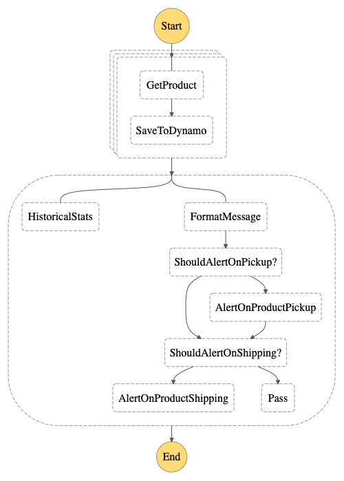

# Target Tracker Serverless Application

With the shortage of baby formula, I decided to experiment with a serverless application
that will periodically check Target for product and give me an email alert.

## Notes

* This project is just an experiment to get more familiar with Step Functions and how they can be structured in a Go project.  Also I really needed baby formula.

* This project uses [Go Workspaces](https://go.dev/blog/get-familiar-with-workspaces) to maintain multiple functions and a state machine in one project directory.

* The provided SAM template assumes there are SSM parameters to store the email addresses for SNS subscriptions.  I used 2 different emails.

* Make is used heavily for testing and running Step Functions locally to validate the state machine.

## Step Functions

The primary driver of the application is an AWS Step Function.



The Step Function (state machine) expects an input containing a list of products to query:

```json
{
    "products" [
        {
            "name": "product name",
            "tcin": "internal product code",
            "desired_quantity": 1,
            "product_url": "link to website for alert"
        }
    ]
}
```

The application is configured to run a scheduled AWS Event Bridge rule every hour with this payload.

For each product, a Lambda function is called to query Target for availability within a certain radius.  The results of the query are saved to DynamoDB for record keeping.

The result of the first stage of the state machine is a list of query results.  This list is sent to another Lambda to parse and turn in to an alert message.  If there are no stores with any products, an empty message is returned to implictly indicate no alert should be sent.  Another choice is included to manually disable SNS alerts.  This was added because enough stores had product so there was less value in a continuous alert that says basically the same thing each time.  Toggling this choice controls the SNS alert flow.

Finally, if there is an alert to send, an SNS topic with email subscriptions recieves the message and ends the state machine.

## Lambda Functions

There are three Lambda functions in this state machine

### Product Checker

The Product Checker function recieves a product as input.  It will query the Target API and parse the results.  It will return a list of stores for the product (if any), and the total count.  It will also query the API for shipping options.  In addition, it will calculate a TTL for saving this result in DynamoDB.

### Message Formatter

The Message Formatter function recieves a list of product query results and determines if an alert message can be created.  If there are no products available it will return an empty string.  The empty string is used by the Choice Rules in the state machine to avoid publishing to SNS.

### Historical Stats

The Historical Stats function recieves a list of product query results and saves the data in JSON format to an S3 bucket.  It runs in parallel with the Message Formatter function.

Why an S3 bucket?  Why not just make a secondary index in DynamoDB?  I decided that since this data is read only, and is updated on a fixed schedule, the added cost of a secondary index in Dynamo didn't make sense for this purpose.  To read this data only requires an API call to an S3 object, which removes the need for any API Gateway or other layer as well.

## DynamoDB

The product results are stored in DynamoDB for auditing purposes.  Only a week of data is maintained in order to keep storage costs low.  A TTL is created by the Product Checker Lambda function as there is no current way to generate this from the intrinsic functions within the state machine.
